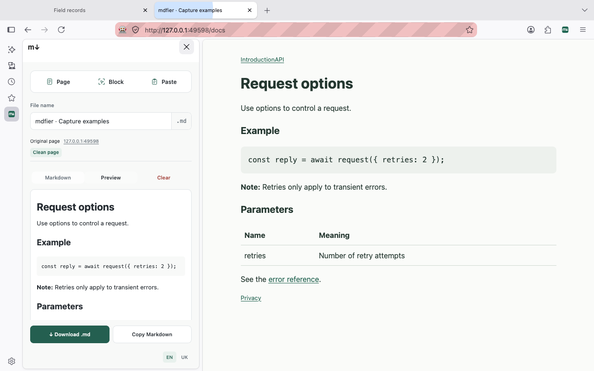

<p align="center"></p>
<h1 align="center">mdfier</h1>
<p align="center"><strong>Turn the web into useful Markdown.</strong><br>Capture · Edit · Preview · Export</p>
<p align="center">
  <a href="https://github.com/gddddkkkmmnn/mdfier/actions/workflows/ci.yml"></a>
  <a href="LICENSE"></a>
</p>
<p align="center">Firefox & Chrome · English & Українська · Local processing</p>

mdfier turns web content into an editable Markdown document alongside the page. No account, AI service, analytics, or upload. Capture runs only when you ask for it.

**0.4.2 is the first MVP release.** Download the browser packages and matching source from [GitHub Releases](https://github.com/gddddkkkmmnn/mdfier/releases/latest). Store listings are pending; these unsigned packages are for local developer installation. See the [verification record](docs/verification.md).

## Capture what matters

| Action | Result |
| --- | --- |
| **Page** | Readable content from the loaded page, including text below the fold. |
| **Block** | The exact part you pick. Use the arrow keys to adjust its scope. |
| **Selection** | Highlighted text captured from the page context menu. |
| **Paste** | Rich text, plain text, or Markdown brought into the editor. |

Edit, preview, copy, or download a UTF-8 `.md` file. Each open tab has its own working draft. Captured pages include their source URL and capture date in the export. Drafts are temporary and cleared on browser restart; download anything you want to keep.



## Install locally

Use Node.js 24, npm, Git, and the standard `zip`/`unzip` utilities:

```sh
npm ci
npm run release
```

| Browser | Load the build | Open mdfier |
| --- | --- | --- |
| Firefox 142+ | `about:debugging` → **This Firefox** → **Load Temporary Add-on** → `../mdfier-firefox-unpacked/manifest.json` | Pin mdfier in the extensions menu, then click its toolbar icon. The sidebar menu works too. |
| Chrome 116+ | `chrome://extensions` → **Developer mode** → **Load unpacked** → `../mdfier-chrome-unpacked` | Pin mdfier in the extensions menu, then click its toolbar icon. |

After rebuilding, reload the extension in the same browser management page. Firefox temporary installations are removed when the browser restarts.

The release command creates both unpacked builds, browser ZIPs, a reviewer source ZIP, and SHA-256 checksums next to the repository. `npm run package:firefox` uses the same pipeline and also provides matching AMO files in `dist/firefox/`. Generated files and dependencies stay out of Git.

## Development

```sh
npm test
npm run typecheck
npm run verify:parser-lab
npm run build
```

Run `npm run dev:firefox` for Firefox development or `npm run dev` for Chrome. Optional [installed-browser tests](docs/browser-testing.md) exercise the production extension in isolated profiles.

- `entrypoints/` — sidebar, background and capture script.
- `lib/` — local extraction, conversion, sanitization and translations.
- `tests/` — anonymized fixtures and regression tests.
- `scripts/` — packaging and verification tools.
- `docs/` — privacy, architecture, verification and store submission notes.

## Boundaries and privacy

mdfier captures already-loaded content. It does not autoscroll, crawl links, read form values, or extract iframe, Shadow DOM, PDF, canvas or media content. Browser-protected pages cannot be captured. Ambiguous page text is kept conservatively; use Block or edit the result when needed.

[Privacy](docs/privacy.md) · [Extraction](docs/semantic-extraction.md) · [Firefox submission](docs/firefox-review.md) · [Chrome submission](docs/chrome-review.md) · [Contributing](CONTRIBUTING.md) · [Security](SECURITY.md)

## License

[MIT](LICENSE). Third-party components retain their own licenses; their [notices](public/THIRD_PARTY_NOTICES.txt) ship with every build.
